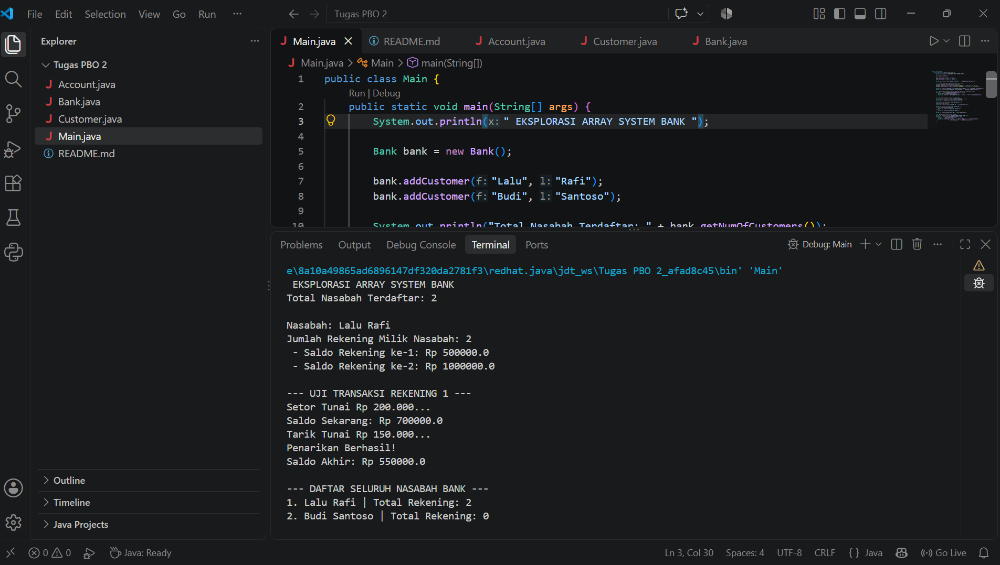

# Latihan Array Java - Bank System

Proyek ini dibuat untuk memenuhi tugas **Eksplorasi materi Array** pada bahasa pemrograman Java.

## Deskripsi
Program ini menerapkan konsep Pemrograman Berorientasi Objek (OOP) menggunakan **Array Murni (Fixed-Size)**.

## Struktur Kelas
1. **`Account`**: Menyimpan saldo serta method `deposit` dan `withdraw`.
2. **`Customer`**: Mengelola data nama dan array dari objek `Account[]`.
3. **`Bank`**: Mengelola array dari objek `Customer[]`.
4. **`Main`**: Melakukan pengujian pembuatan objek dan pemanggilan method array.

## Cara Kompilasi dan Menjalankan
## Cara Kompilasi dan Menjalankan

```bash
javac Main.java Bentuk.java BujurSangkar.java Lingkaran.java Silinder.java
java Main
```

## Screenshot Hasil Eksekusi Program


